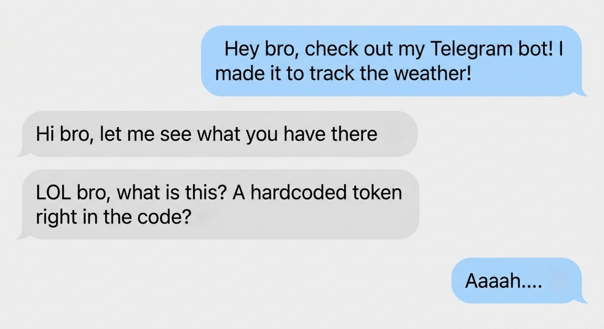

# Secrets Management lab

# Initial problem and the main question..
One day I was practicing building my own Telegram bot that would track the weather in my city! After I finished it, I decided to send my project's code to my friend to check out! And here's what came out of it..

And that's when I asked myself — where and how can you actually store passwords or tokens, if not directly in the code? Let's find out together!

# Starting the breakdown
First, I thought about it — what ways are there to store sensitive data outside of the code? And for that I found a useful site: [12factor.net](https://12factor.net/config)

It's a methodology made of 12 factors, and for our breakdown I read the 3rd factor, "config". After reading it, I understood there are multiple ways to do this, here are a few of them:

- Way 1 — store it right in the code, for example `TOKEN = verycooltoken123`. As we remember, this is the worst way — if you ever decide to publish your code or send it to a friend, your token can get stolen! This doesn't work for us..
- Way 2 — separate the sensitive data into its own config file! For example `config.json`. This is a decent way and I might have considered using it, but then you end up with a mess of config files, and you could still accidentally add the file to the project — so this doesn't work for us either..
- Way 3 — the last way I read about! This one is about environment variables. These are text values in the format `key = value`. They don't live in the project's files! They sit right inside the operating system / terminal where the program itself is run. Your app's code simply asks "give me the TOKEN variable", and where that variable actually comes from doesn't depend on the code at all. This is the industry standard, and exactly what we need!

Let's think about how to actually use these environment variables?
#
