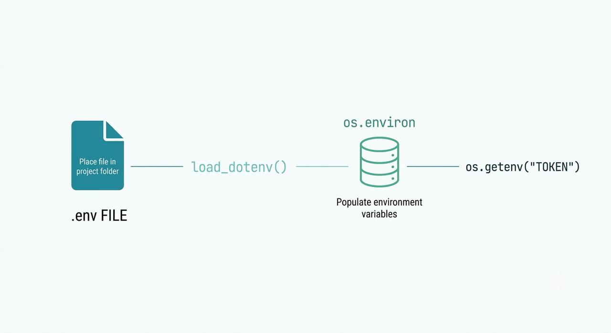
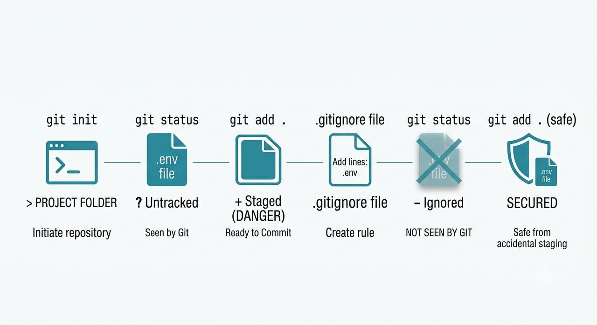

# secrets-management-lab

# Initial problem and the main question..
One day I was practicing building my own Telegram bot that would track the weather in my city! After I finished it, I decided to send my project's code to my friend to check out! And here's what came out of it..


And that's when I asked myself — where and how can you actually store passwords or tokens, if not directly in the code? Let's find out together!

# Starting the breakdown
First, I thought about it — what ways are there to store sensitive data outside of the code? And for that I found a useful site: [12factor.net](https://12factor.net/config)

It's a methodology made of 12 factors, and for our breakdown I read the 3rd factor, "config". After reading it, I understood there are multiple ways to do this, here are a few of them:

- Way 1 — store it right in the code, for example `TOKEN = verycooltoken123`. As we remember, this is the worst way — if you ever decide to publish your code or send it to a friend, your token can get stolen! This doesn't work for us..
- Way 2 — separate the sensitive data into its own config file! For example `config.json`. This is a decent way and I might have considered using it, but then you end up with a mess of config files, and you could still accidentally add the file to the project — so this doesn't work for us either..
- Way 3 — the last way I read about! This one is about environment variables. These are text values in the format `key = value`. They don't live in the project's files! They sit right inside the operating system / terminal where the program itself is run. Your app's code simply asks "give me the TOKEN variable", and where that variable actually comes from doesn't depend on the code at all. This is the industry standard, and exactly what we need!

Let's think about how to actually use these environment variables?


# Getting started, reading up on .env and .gitignore
Let's start! First, I decided I should read up on two things:
- How does working with .env and python-dotenv work?
- How does working with .gitignore work?

I opened the official documentation, and let me quickly tell you what I got out of it:

Working with .env and python-dotenv:
Put simply, it's just a regular text file in the format `key = value`. So how do we actually work with it? Since my Telegram bot was written in Python, we'll need the python-dotenv library, because Python itself doesn't know how to read .env files out of the box.

After we successfully install the library, I want to walk through the mechanics of how it works:

```
First, we create a .env file and place it in the project folder >
> then the load_dotenv() function reads the .env file >
> this function takes what it read and drops it into os.environ >
> and the code itself talks to it through os.getenv("TOKEN")
```

Pretty simple overall, but if the breakdown in words didn't quite land, I made an illustration specifically for that:



Now let's talk about and go over working with .gitignore:

Here I actually want to directly quote the official [documentation](https://git-scm.com/docs/gitignore):

> A gitignore file specifies intentionally untracked files that Git should ignore.
> Files already tracked by Git are not affected

I'm not going to add anything to this explanation, I think it's perfect as-is — instead let me just show you the mechanics of how and why it works, since the dry explanation probably didn't fully land:

Let's say we have a .env file with our token, and we want to push the code to GitHub, but we don't want other people to see our token — what do we do?

.gitignore is here to help, let me show you with two examples as well:

```
First, we run git init in the project folder >
> without a .gitignore, the .env file is visible to git as a regular file (git status shows it as untracked) >
> if we run git add . — the .env file gets added to the "ready to commit" list (staged), meaning it's literally one step away from going into the repository >
> now we create a .gitignore file and write one line into it — .env >
> when we run git status again — the .env file is no longer in the list at all, git simply doesn't see it as a candidate for tracking anymore >
> which means now even an accidental git add . won't pick up .env, because the .gitignore rule excludes it before that step even happens
```

I hope you got the mechanics of how it works, but if dry text is still hard to take in, same as it is for me, I made an illustration for this too:


